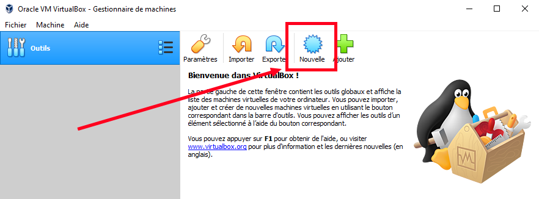
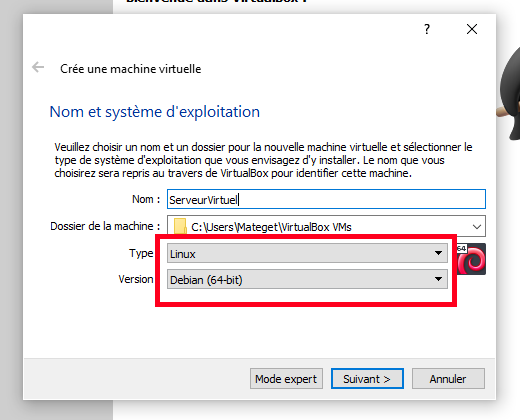
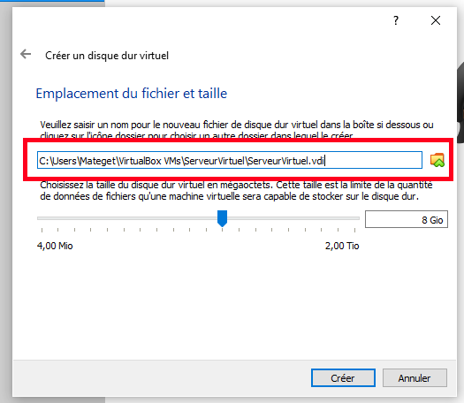
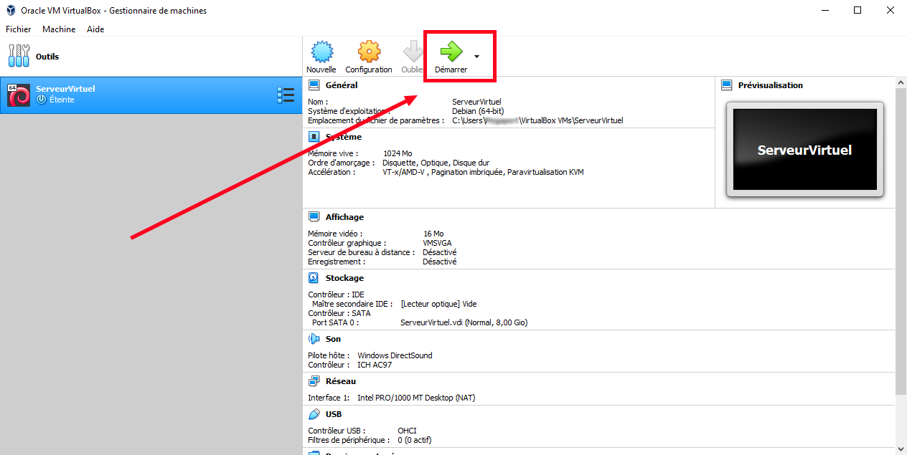
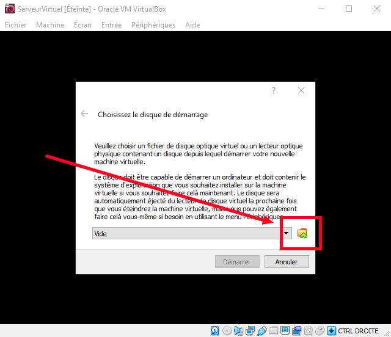
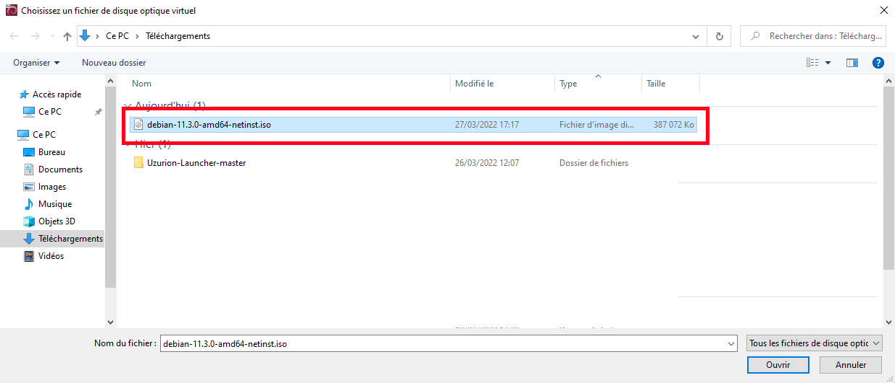
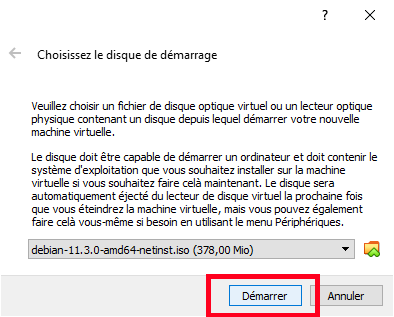

# Mise en place d'un serveur Web avec PHP

Cette partie est dédié aux utilisateurs qui n'ont pas de serveur web déjà mise en place. 
Le serveur web va permettre au launcher lors de son démarrage d'aller chercher la configuration et les fichiers que vous voulez ajouter au client minecraft comme des mods par exemple.  

Il y a ici deux possibilités:
 - Soit vous n'avez pas de serveur distant, dans ce cas nous utiliserons une machine virtuel en local, le launcher ne fonctionneras donc que pour vous
 - Soit vous avez un serveur distant et le launcher fonctionneras pour tous les utilisateur à qui vous partager votre launcher

## Mise en place d'un serveur en local

Si vous avez un serveur distant, passez directement à l'installation du serveur web et de Php.
Pré-requis : 
 - Installer Virtual Box
    - [Windows](https://download.virtualbox.org/virtualbox/6.0.24/VirtualBox-6.0.24-139119-Win.exe)
    - [Mac]
 - [Télécharger une image Debian](https://cdimage.debian.org/debian-cd/current/amd64/iso-cd/debian-11.3.0-amd64-netinst.iso)

Une fois Virtual Box installé, il faut créer une machine virutel à partir de l'image téléchargé.

Il faut bien choisir le type de la machine virtuel.

Concernant la RAM à alloué 1024 Mo est largement suffisant. 
Choissiez ensuite "Créer un disque dur virtuel maintenant". 
Choissiez ensuite "VDI (image de Disque VirtualBox)". 
Choissiez ensuite "Créer un disque dur virtuel maintenant". 
Choissiez ensuite "Dynamiquement alloué". 

Vous pouvez changer l'endroit ou le fichier de la machine virtuelle sera enregistré, vous pouvez également changer la mémoire disponible, mais sachez que 8Go est largement suffisant.

Voux pouvez démarrer votre machine virtuel.

Lors du premier démarrage il va vous être demandé de choisir l'image a utilisé.

Vous devez idiquer l'emplacement de l'image que vous avez télécharger plustôt.

Vous pouvez ensuite cliquer sur "Démarrer".

